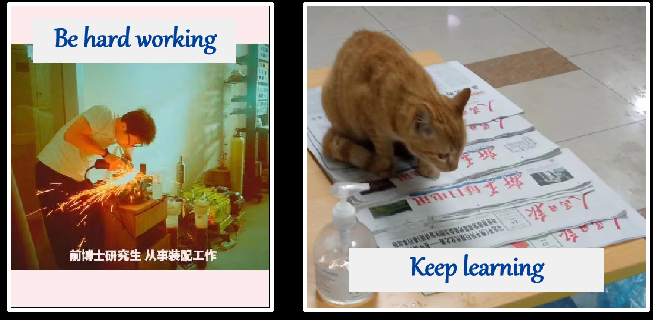

#  核材料腐蚀性能研究指南 :id=start

> 在交大苟活十年，在实验室混迹八年，一事无成、毫无建树，最终落得一个疑似延毕的境界。
本人的失败经历可能前无古人愿后无来者，因此将多年拧螺栓、磨试样的经验将汇总于此，望之后的师弟师妹好好学习，引以为戒，早日毕业。

**生存指南补完计划**:

?> ↖ 事先声明，以下内容不是目录，手机上看目录请点左上角`≡`按钮

* [X] 103 质量管理
* [X] 202 温度测量与控制
* [ ] 203 高压容器与管道
* [ ] 301 基础化学实验
* [X] 304 双环动电位扫描
* [X] 305 电镀
* [ ] 401 均匀腐蚀行为基础
* [ ] 501 应力腐蚀行为基础
* [ ] 502 裂纹萌生与高温蠕变
* [ ] 702 微观表征样品制备
* [ ] 801 MS Office三件套

?> 以上内容仅为计划，若未及时更新，算我鸽了

<b>咕~ 咕~ 咕~</b>
