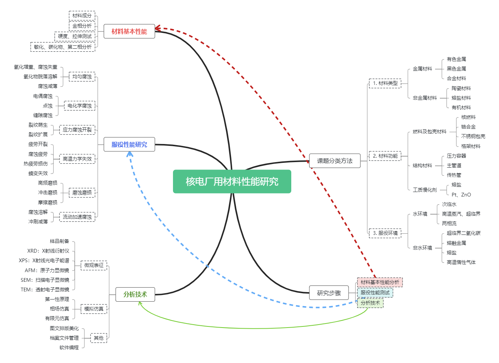

?> 👇这是图片版，WPS做的



---

?> 👇这是markmap版，可以缩放

<center>

```markmap

# 核电厂材料腐蚀研究
## 研究对象分类
### 材料类型 <!-- markmap: fold -->
- 金属材料
  - 有色金属
  - 黑色金属
  - 合金材料
- 非金属材料
  - 陶瓷材料
  - 熔盐材料
  - 有机材料
### 材料功能
- 燃料及包壳材料
  - 核燃料
  - 锆合金
  - 不锈钢包壳
  - 格架材料
- 结构材料
  - 压力容器
  - 主管道
  - 传热管
- 工质慢化剂
  - 熔盐
  - Pt、ZnO
### 服役环境
- 水环境
  - 次临水
  - 高温蒸汽、超临界
  - 两相流
- 非水环境
  - 超临界二氧化碳
  - 熔融金属
  - 熔盐
  - 高温惰性气体

## 服役性能研究
### 均匀腐蚀
- 氧化增重、腐蚀失重
- 氧化物脱落溶解
- 腐蚀减薄
### 电化学腐蚀
- 电偶腐蚀
- 点蚀
- 缝隙腐蚀
### 应力腐蚀开裂
- 裂纹萌生
- 裂纹扩展
### 高温力学失效
- 疲劳开裂
- 腐蚀疲劳
- 热疲劳损伤
- 蠕变失效
### 磨蚀磨损
- 高频磨损
- 冲击磨损
- 摩擦磨损
### 流动加速腐蚀
- 腐蚀溶解
- 冲刷减薄

## 分析技术

### 材料基本性能
- 材料成分
- 金相分析
- 硬度、拉伸测试
- 敏化、碳化物、第二相分析

### [微观表征](/ch7/701微观表征导则.md)
- 样品制备
- XRD：X射线衍射仪
- XPS：X射线光电子能谱
- AFM：原子力显微镜
- SEM：扫描电子显微镜
- TEM：透射电子显微镜

### 模拟仿真
- 第一性原理
- 相场仿真
- 有限元仿真

### 其他
- 图文排版美化
- 档案文件管理
- 软件编程

```

</center>