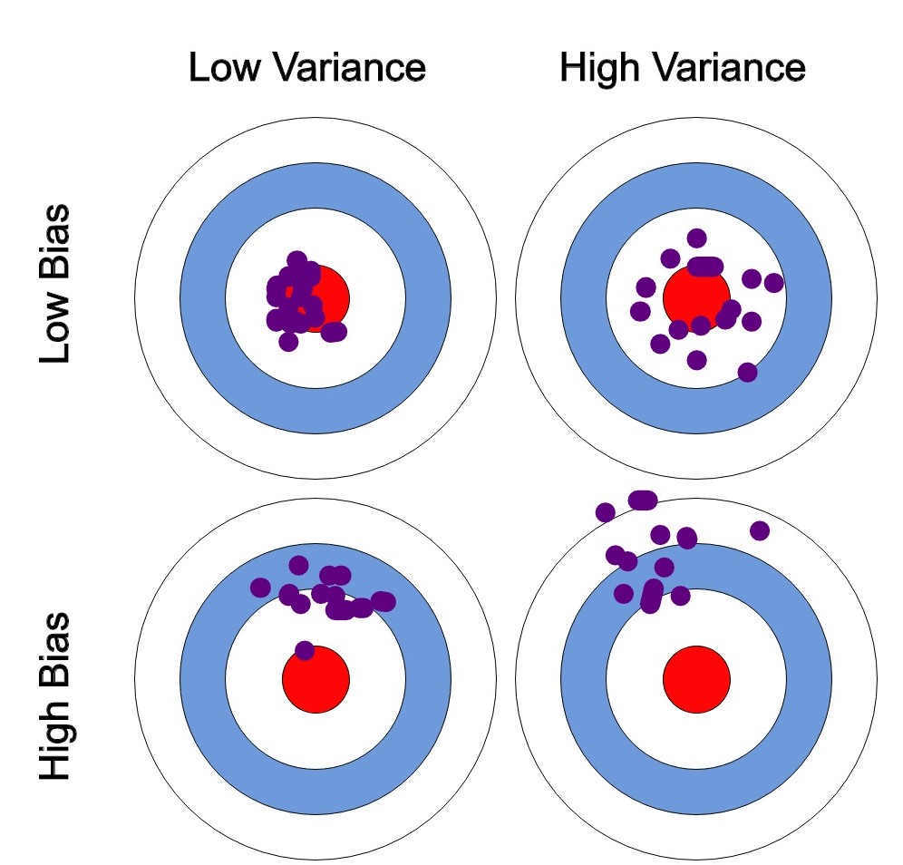

> 质量保证文件、文档、说明等，一般是指在研究过程中，如何保证测试方法可行、测量结果可靠、分析逻辑正确的文档。
>
> 在材料性能评价过程中，最重要的是对环境、载荷等测试参数的有效监控，做到“**可测**”，“**可控**”。测试方法一般出现在试验大纲文档中，或单独成一份操作大纲。质量保证、质量大纲则是对这些测试方法可靠性和准确性的描述。
>
> 顺便看看另一个文档：[**701 微观表征导则**](ch7/701微观表征导则.md)

## 质量管理
质量管理从技术上是一件较为简单的事情，但从管理制度和执行上。。。。。。无需多言。

在面向较为重大的横向课题、纵向课题时，完整的质量管理体系是非常必要的。一方面这是从法律法规上一层层落下来的规章制度，很多的审查文档是必须提交的；另一方面，确实是对项目负责的态度，有些质保文档可以使用套话应付过去，但质量管理是必须执行到位的。

### 作为实际执行人
有义务去了解和学习通用的质保规则，清楚所负责实验环节的质保要求。有能力开展自我审查，确认自己所作的实验是否合理、误差几何。

### 作为分项负责人
有义务制定完善的质保大纲，并做好监督落实工作。要求对课题各个环节有清楚的认知，至少能够分辨实验过程的合规与否、测试结果的可靠与否。

有时候学生作为某个课题的实际执行人和负责人，可能会忽略某些必要的记录过程，例如自己做完实验，当即判断结果的可靠与否，并未做完整的记录和验证，就开始下一步骤了。这种情况应当避免，各类阶段性的结果和验证过程都应有记录，否则就不要写入自己的质保大纲（计划）中。

### 作为总体负责人
项目较为复杂庞大时，技术细节过多，文档内容繁杂。要求负责人有丰富的实操经验和管理经验。即使是复杂文档，也应当有能力从常识的角度，分辨操作大纲、质保大纲等材料中的漏洞和问题，并提出相应的解决策略。

!> **最重要的事情，还是要落实到位，关注自身和周边的质量问题，杜绝不合理操作。**

## 质保大纲
**质保大纲一般包括的文件体系：**
- 总体要求
- “概述-管理-操作”三级质保大纲文件
- 程序、细则、图纸等相关支撑材料
- 见证、审查的文档与记录

?> 质保大纲的撰写与执行是有相应的套路的，只要在实验的过程中关注一些重点问题，就可以实质性地提高测试结果的质量。

### 参考：法规、标准和文献

质保大纲实际上更像是一种底线——项目的最低质量要求。通常对应着法规和标准的要求，是必须要学习并落实的部分。着一些内容的要求是严格的，希望能够认真遵守。当然，核领域的法规过于宏观，而国家标准所覆盖的领域并不完整，国外标准也并非每个细节都照顾到了。所以还需要很多已有标准之外的知识来支撑质保大纲的制定。

作为科学研究相比于普通的工厂化测试，需要对质保大纲进行一些拔高，拔高的这一部分就来源于参考文献和研究经验。这一部分的依据并非死板的规章制度，而是来自于对基础科学的认知。例如：均匀腐蚀实验，在基础标准所要求的腐蚀增重曲线的计算和复验之外，还增加了脱模后腐蚀速率的计算、氧化膜厚度均匀性的测量等等。

?> 一方面科研所用的操作大纲和质保大纲是是多种标准、文献信息中实验方法和检验方法的综合;另一方面，科研过程也是在改进和创造新方法、新标准、新要求的过程。在制定操作大纲、质保大纲，做实验、做总结的过程中，也务必注意这一点，多思考通用标准要求我做什么，我又能为提升标准做什么。

### 偏差与复验

**实验问题：**
* **系统误差：**由于测量过程中的方法或硬件的缺陷而导致结果在特定方向上持续偏倚的误差。例如观察液位的时候未平视液面、使用游标卡尺前未归零、仪表长期未校准已经出现偏差......
* **随机误差：**测量过程中的偶然变异而导致偏离真实值的误差。例如测量样品直径时不同点位的测量、样品均匀腐蚀后增重量并不严格一致......

**统计学上：**
* **偏差：**描述的是预测值（估计值）的期望与真实值之间的差距。偏差越大，越偏离真实数据。
* **方差：**描述的是预测值的变化范围，离散程度，也就是离其期望值的距离。方差是衡量源数据和期望值相差的度量值。方差越大，数据的分布越分散。

?> 质量大纲中应当说明可能的偏差来源、偏差值的预测（分项和综合）、避免系统误差和减少随机误差的方法、数据的复验方法等。例如通过增加待测样品数量来降低随机误差、通过多种测量手段测量、计算和核验裂纹长度等。

### 变更
在实验过程中，难免发生方法和参数需要变更的情况。如果是自研课题，变更应当有所记录，并通过交流商讨的方式确定新的参数。如果是项目，变更前应当与甲方进行协商，明确变更理由和新方案，并签字确认，合规操作以避免权责纠纷。

?> 一个未完成的参考文件：<a href ="/ch1/附101质量交汇.docx" target="_blank">质量交汇.docx</a>
