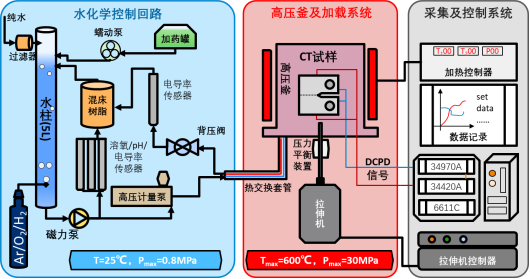
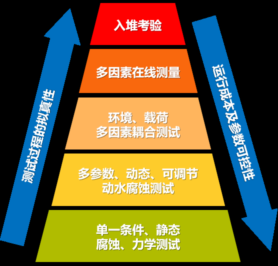

> 高温高压测试系统是反应堆材料服役性能测试的一个重要工具。测试系统的目的是模拟材料的实际服役工况，需要创造工质环境、载荷条件，甚至应当具有辐照功能。提供高温、高压环境是测试系统的最基本功能。
>
> 本文档将介绍高温高压测试系统的设计原则、结构功能、运行原理以及其他注意事项，更加详细的操作方法请间本章下的其他文档。
>
> *2024-01-13，Haozhan：新建了该文档*
>
> *2024-01-30，Haozhan：V01*

## 设计原则

测试系统的核心是一个容器——即环境，围绕这个容器安装配置多个组件，实现对环境的测量和控制。因此这个测试系统应当具备相应的功能。

为了实现相应的功能，除了钱要到位之外，很重要的一点就是——设计人员和操作人员都应具备一定的物化、机械、自动化的知识，以确保在设计、加工、装配、运行过程中满足**测试要求**和**安全要求**。

### 基本功能

模拟实际测试环境，实现对主要环境参数的检测与控制。以水堆环境为例，最需要关注的环境条件为温度、压力、流速、离子种类及浓度，溶解气体种类及浓度（共同决定了pH、电导率、腐蚀电位等）。

实际上环境的模拟包括几个部分：测量、记录、运算、反馈。针对某一条件参数的多个装置能够实现上述四步即组成了针对该参数的**测控系统**。

* **测量**：核心部件为传感器，实现最基本的物理信息向电信号的转化，例如热电偶、压力表、水化学仪表等。
* **记录**：将电信号进行采集、传输和记录的过程，主要依靠上位机进行记录。
* **运算**：根据各物理量的记录，计算出后续一段时间内，各控制机构的动作。例如宇电表、PLC、上位机等均有能力实现计算功能。
* **反馈**：各控制机构接收信号后发生动作，实现对物理量的控制，例如气体质量流量计、加热圈。

?> 当然，以指针式压力表为代表的“物理量-物理量”传感器的工作模式不同于完整测控系统的工作模式，只能起到数据显示的作用，属于非自动化控制的部分。一些智能型变送器集成了信号转换、数据显示、运算、反馈等多个功能，例如宇电表既是模拟量电信号向数字电信号转化的变送器，又是PID调节的运算器，同时还可以与上位机进行通信。

### 安全保障

安全保障主要分为三个方面：人员、成果、设施。

* **保障生命安全底线**：操作人员和其他可能受到影响的人员安全是首要保护的对象，在设备安装阶段应当考虑安装人员与各部件的交互的可能性，主要避免机械伤人和漏电事故；在运行阶段考虑高温、高压、带电部件的操作，规避人员与高危系统的直接接触；在事故发生时，应当留有安全空间，供人员进行紧急操作。当前多数测试系统的结构较为简单，一般不会出现大规模泄露、爆炸、燃烧的风险。
* **重要测试成果优先**：在保障人员的前提下，应当使测试系统能够最大限度的保护重要测试结果。例如在断电时使用UPS延长数据记录时间，事故发生时能够通过一系列安全动作确保测试环境的波动最小，或进入对结果影响最小的保护性环境中。总体来说，应当使事故发生概率最低、作用时间最短、影响幅度最小、影响的可恢复性最大。
* **设施经济平衡考量**：测试系统的设计、运行和事故发生后的决策和恢复都需要考虑经济性，在条件允许的情况下，应当保护测试系统的重要零部件，例如避免低温传感器暴露、避免长时间恶劣工况运行、关键装置的防尘防水等。

## 结构功能

按之前的绘图和划分逻辑，应当分为三部分：水化学回路、高压釜及加载、采集及控制。这是一种按照装配逻辑来进行划分的办法：

* **水化学回路**：以面板或机柜的形式出现，集成度较高，以电源-信号电缆的形式与采控系统链接，以压力管道的形式与高压釜链接。
* **高压釜与加载**：高压釜与加载装置通过硬连接，安装在同一个机架上，组成完整的机械结构，对于安装精度有一定的要求，一般不进行拆分。
* **采集与控制**：以机柜形式存在，包含有工控机（上位机）、显示器、温控器、拉伸机控制器、电信号采集系统等。其核心是信号的传递、采集、处理与反馈。

?> 实际上，从功能特性、组件模块化等角度出发，还可以按另一种方式划分。水回路以背压阀和高压泵为分界线，基本可以划分为低温低压和高温高压两部分。拉伸机应当与其控制器共同组成一套完整的机电控制系统。其他组件则可以构成工控系统。

### 低压水回路

低压水回路部分的主要作用是用于多数水化学参数的测量、控制，工质压力一般不超过1.6bar，多数管路和接头可以使用塑料材质。此时的水化学状态一般代表高压釜入口的环境参数（通过合理设计回路面板可以实现对出口参数的监测）。

* **容：**玻璃水柱、不锈钢水罐等容器，最主要的工质存储空间，一般数倍于高压釜容积，用于容纳多数工质、容许因热膨胀导致的水位升高。
* **滤：**过滤器和树脂，其中过滤器一般使用超细过滤器，放置在树脂混床后端，用以过滤可能被冲出的树脂（一般树脂床本身也有过滤结构），树脂则是用于纯化，控制水回路中的粒子浓度
* **气：**气体供给，例如氢气、氧气、氩气、氮气等，一般使用鼓泡法从容器底部注入。
* **表：**各类水化学仪表、压力传感器等，用于监测低压部分的水化学状态。

### 高压水回路

高压段的管路和容器一般使用不锈钢材料，理论承压极限一般超过40MPa。在高压釜及部分管道中，工质温度最高可达650℃以上。

* **泵：**两个主要泵——磁力泵和高压计量泵，磁力泵流量大压力小，主要用于低压部分的水循环，并供给足量的工质到高压泵；高压泵压力高流量小，用于高压釜内的工质循环。
* **阀：**关键部分为背压阀，在高压釜出口部分，通过转动调节背压大小，与高压计量泵共同实现了高压釜内的压力稳定。此外，管路上还有高压超细过滤器、单向阀、球阀等结构，以确保回路正常运行。
* **管：**使用套管结构，实现一定的热交换，也可以使用热交换器和冷却器来实现相应功能。
* **釜：**即高压釜，样品所处的容器，高压釜分为釜体和釜盖，多数贯穿件位于釜盖上，例如进出水管、拉伸杆贯穿件、热电偶贯穿件、导线贯穿件、电极贯穿件等。釜体外则有加热圈和保温棉，实现升温保温。

### 加载系统

即实现样品加载功能的全套设备，包括釜内的支撑结构、样品夹具、拉伸杆，釜体外侧的传动结构、减速机和电机，以及电机的控制、伺服系统。

* **夹：**样品夹具及支撑结构，这部分位于釜内，需要使用耐热耐腐蚀材料加工，有时需要根据样品尺寸进行定制，实现样固定、绝缘等功能。
* **传：**传动结构，一般是由加载框-力传感-滚珠丝杠-减速机的结构组成，多数载荷测量和限位装置也固定在这一结构上。
* **机：**伺服电机，加载的动力源，一般配有编码器用于位移测算。当然也可以使用其他测量手段实现位移测算。
* **控：**即电极的控制和伺服，一般的伺服电机需要一个伺服器及一个控制器，控制器用于采集力、位移信号，向上位机传输数据，并根据上位机指令向伺服器发出脉冲信号。而伺服器根据脉冲信号调整对电机的功率输出，实现运动。

### 工控系统

* **电：**电控系统，通过开关、旋钮等调节以上各类电器、阀门的运行状态，采集上述组件产生的电信号并传输给PLC或上位机。
* **算：**计算机，工控机，即上位机，处理各端口的信号，显示、记录并根据设定程序调整输出信号。

?> 实际上对结构的划分并不影响每个组件的功能，也不影响整体的存在。只是为了便于理解其工作的逻辑，方便使用、保养和维护。

## 其他

后续的小结中，按功能性（即测控的条件参数）对各系统或部件进行了划分，工作原理、使用方法及维保方法请参阅后续章节。