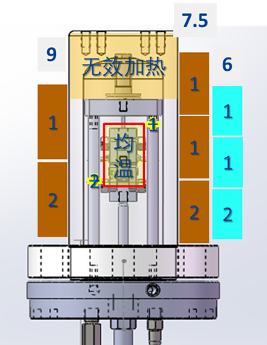

> 温度即......温度，不用详细解释吧。
> 以下将简要介绍温度控制的逻辑、主要硬件、维保方法

## 温度控制逻辑
开始学习温度控制之前，建议先回头复习一下[**基本测试系统**](/ch2/201高温高压测试系统基本结构.md?id=testsys)，特别是去实地认知一下硬件系统。

### 基本结构
温度控制系统包括（为减少篇幅就不放实物图了）：
* 热电偶（包括K型、R型、S型......）
* 温控表（宇电，集成温度采集、通讯和控制）
* 加热圈（含控制电路）
* 高压釜及保温套（容器）
* 进出水换热（套管换热结构）
* 冷却器（螺旋管换热结构）

### 均温保持
?> 建立温度控制系统的最主要目的就是形成并长久保持一个**均温区**，所有测试样品将安放在均温区里（下图为一典型高压釜结构）。

以下
### 1

### PID调节系统

### 智能型温控器

### 加热圈

## 使用、维护及保养

### 热电偶标定

### 保温与散热

### 温控器整定

?> 正在编写

