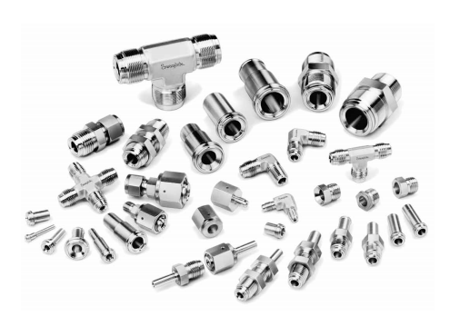
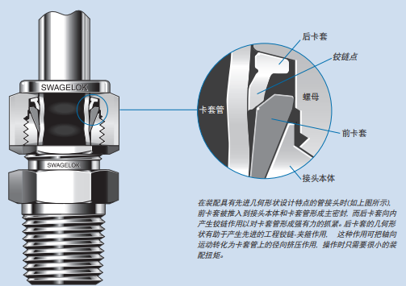

!> 高压釜作为测试发生的核心区域，是服役条件最为恶劣、安全风险最高的区域。工质泄露、工质喷发、管道零配件弹出等，都可能导致人员受伤，因此高压釜等容器和配套的管道阀门的正确使用和维保十分重要。

## 基本概述
首先，按照理论来讲，常用的高压釜并不能算是压力容器，但也很接近了。所以设计、建造、使用的过程中，也要注意相关的安全风险。

其次，整个测试系统的工质是相连的，也是分区的。高温高压区的危险系数最高，所用的基本都是金属容器或管道，其安装和使用需要格外小心。低压区往往也是低温区，主要是装配了各类探头。两个区域都应当格外注意：
- 停机和运行时阀门的通断状态，避免出现堵塞、死管、泄露、死管等情况；
- 容器、管道、阀门、测量等都有其许用的温度、压力、流量和工质范围，所以在安装、维护、更换之前都要注意；
- 禁止带高压条件下开展快速排水（气）、拆装部件的操作。

## 容器与管道

### 材料问题
- **316不锈钢：**最为常见的容器和管道材料，具有较好的耐腐蚀性能，一般用于400℃以下、离子浓度较低（10ppb）、中性环境，加工性能好，造价低。
- **镍基合金：**具有极佳的耐腐蚀性能和高温力学性能，最高可满足超临界水腐蚀测试要求，加工性能一般，造价较高。
- **钛合金：**极佳的抗腐蚀性能，一般可满足360℃以下水、水蒸气腐蚀测试，可规避铁、铬、镍等材料主要元素的腐蚀释放问题，但长期使用存在脆化问题，难以单独加工制作高压釜，焊接等加工性能极差，造价高。
- **其他材料：**部分管道接头可能存在304材料，常温常压部分尝试用聚四氟乙烯的软管、PVC接头、硅胶管等塑料制品，承压绝缘材料PTFE。

### 高压釜
高压釜一般分为釜体和釜盖两部分。作为核心部件，其设计和加工都是需要着重考虑的问题。首先要考虑其容积、尺寸，根据测试需求对釜体内部容积进行确定，然后根据温度压力计算满足安全需求的壁厚，最终综合确定整体尺寸。

一般情况，贯穿件都在釜盖上，在设计过程中就需要考虑连接头的种类、安装的空间和顺序、检修维护的便捷性、长期使用的可靠性等。不但是贯穿件，同时还要考虑高压釜螺栓的安装是否存在干涉等问题。（各密封方法在后文介绍）。

除了常规的“釜体-釜盖”这样的结构外，还可以制作衬套釜结构（内衬钛合金或镍基合金以提高抗腐蚀性能）、长管容器结构、法兰分体结构等。具体结构根据测试需求和加工便捷性确定，其基本设计思路和维护保养的要点大体相同。

### 管道
管径问题：常用管径为英制，即1/8、1/4、3/8、1/2、3/4等，更大尺寸的比较少见。相应的管接头也多为英制单位，但需要注意的是，部分极小的气体管路中存在非英制接头，请务必注意。

套管结构：常用的热交换结构。多数英制管的内径是恰好略大于小一号的管子的外径的，因此可以做嵌套结构，实现热交换。并制作一段盘管来提高热交换效率。

加工技术：
- 截断务必使用截管器，可以保证端面平齐，且无毛刺。若特殊情况必须使用切割截管，请务必保证端面平齐，并在切割后使用锉刀去除毛刺。
- 折弯过程使用弯管器，1/8管和1/4长管可徒手调整，但大角度折弯过程容易导致管子畸形。
- 若焊接管道，请务必使用同种焊材，当管道作为贯穿件时，请在焊接过程中检查其导通性，避免熔融物堵管。

## 连接与密封

### 高温密封圈到片：平面、弧面与水线
【三种密封结构截面图】
高压釜主密封面一般使用不锈钢垫圈-平面密封结构，由于其温度较高，因此只能使用金属材料（多为316不锈钢）。

另外也有V型槽-弧面密封结构，相对性能更好，但加工精度要求更高，出现损伤后维保难度大。

后期改进设计出薄片-多道水线的密封方式，相对提高了密封可靠性，但需要每次更换密封垫圈。

!> 从经验上来说，当前测试条件下以上几种密封结构并无明显优劣。不良的实验习惯是密封的最大破坏者。无论哪种密封结构，都应当对及时密封面、垫圈进行保养。一是检查是否有划痕、缺陷。二是进行细砂纸打磨，去除氧化膜。三是检查垫圈余高和径向变形。维保工作大约500h到2000h进行一次，具体要根据测试条件和进度安排调整。

### 卡套管接头：管道连接方案
常规的管道连接方式即使用这类卡套接头，连接：管道-管道、管道-阀门、管道-容器。目前使用的绝大多数管道的连接都是基于这种接头实现的。

根据 **[Swagelok](https://products.swagelok.com.cn/)** 的产品说明（ **[PDF文件](附203Swagelok.pdf)** ），不同材质、不同管径的卡套接头都有其许用的温度和压力上限。在实际使用过程中，请务必注意相关的操作要求。

### 锥螺纹密封
锥螺纹密封在多个压力传感器及低温且中低压力的条件下的连接场景中使用。依靠螺纹锥度、螺纹间生料带实现密封。

其具体使用方法同样可以参考**Swagelok**产品说明。

此处仅简单罗列一些要点：
- 锥螺纹密封最好选用同厂原装配对，以免出现深度不统一的情况；
- 生料带按照旋紧方向缠绕，且不宜过厚，一般三到五层即可；
- 锥螺纹容易和直螺纹弄混，特别是母头，所以务必要检查后再拧紧，切勿再阻力较大时盲目加力。

### 动密封结构
动密封结构的密封性较差，长期使用都会出现一些泄露情况。

动密封即四氟弹簧密封圈，主要用于拉伸杆的密封。一般配合一四氟垫片。弹簧密封圈的开口朝向工质方向，垫片在另一侧。由于四氟材料的耐热性能较差，建议在动密封结构附近加装散热装置，可以使用翅片散热结构、水冷散热套管、风扇冷却等多种方式，但务必保证所处环境温度稳定，否则影响测试精度。

?> 动密封结构无法承受非轴向载荷，因此务必保证拉伸杆的同心度、单轴加载。此外，动密封结构也需要定期更换。

### 焊接
!> 除确定不更换的部件外，请勿轻易进行焊接。

焊接是密封性能最好的连接方法。管、接头、容器之间的焊接尽可能保证同种材料焊接。锆合金、钛合金等材料应当使用激光焊接。具体焊接工艺请咨询专业人士，并在实验检测通过后再落实到设备主体上。

## 阀
### 球阀与针阀
主要控制通断，球阀无流量调节作用。针阀具有粗略调节流量的作用。这两种阀门较为常用的型号都使用了四氟垫作为密封结构，因此均不可承受200℃以上高温，请尽可能常温使用。（需用压力与口径、温度都有关系）

### 背压与减压
都是阀前压力大，阀后压力小。
- 背压阀：调节阀前压力，常与泵配合调节釜体压力，也可用于调节水柱中气体压力。
- 减压阀：调节阀后压力，常连接在气瓶出口，控制其供给的气体压力。

### 单向阀
顾名思义，单向导通，防止逆流，水回路板中常用。不同单向阀也有其工作压力，使用时务必注意其方向与压力。

### 过滤器
常见纤维滤芯过滤器和金属烧结滤芯过滤器，分别工作在常压和高压条件下。分别用在应对树脂床出口和高压釜出口。当然也有一类室温下的陶瓷滤芯，用在树脂床内作为第一层过滤，或在水柱底部，作为鼓泡使用。

## 压力监测
压力换算：$ 1 atm = 1 bar = 0.1 MPa $
?> **压力范围：**低压段一般用2.5bar或6bar的即可，高压段用25MPa，超临界用40MPa，工作压力范围在1/3-2/3最好。
### 指针式压力表
机械压力表，通过观察指针，人工确定压力。
安装时禁止扭动表头部分。
**含油/无油：**压力表里面充甘油、硅油，实现抗震和密封。

### 电子式压力传感器
一般需要通过二线制、四线制接头与变送器连接，实现数字化监测与压力控制。使用时注意接线方向。

两种压力监测工具应当共同使用，特别是高压容器，出入口都用至少有一个仪表。其中至少设置一个电子压力传感器。两个仪表的示数可能存在差别，一般以电子式为准。

### 安全装置：泄压与爆破

用于超压工况下直接排放，避免超压事故。**泄压阀**近似于背压阀，一般可以设置安全阈值，超压后开始以一定速率排放工质。**爆破阀**则是一次性安全阀门，超压后膜片破裂，以较高速率排放工质。两种阀门使用时均需要注意其排放方向，并在相应方向上安装排放管道或安全警示标志，避免朝向人员工作区。

## 专题讲解：压力平衡装置
压力平衡装置，即利用静水压力平衡高压釜内胎压对传统拉伸杆的向外推力，理想状态下实现实测载荷=样品载荷。当然由于增加了一节动密封，其摩擦阻力也至少翻倍。安装使用过程中务必保证高度同轴。

!> 通常压力平衡装置会导致拉伸机可动范围缩小，并增加连接件，因此机械控制和检漏工作应当更加注重。

图：涉及技术细节，先欠着，不懂得先用实验室里废旧的研究一下。

## 风险情况及处理原则
- 第一要务：人身安全最重要。
- 运行前务必检查阀门通断情况，确保高压段导通、背压阀处于低压状态。
- 运行时请勿站在管道出口、安全阀喷发方向、背压阀正向、脉动阻尼器上方等可能出现喷射事故的位置。
- 异常工况下首先要保证低压端不出现超压事故（低压端应当尽量使用四氟软管，超压后破裂可减少对传感器的损伤）
- 周期性开展全管段检漏，特别是供气管道，降低气体浪费，避免出现风险。