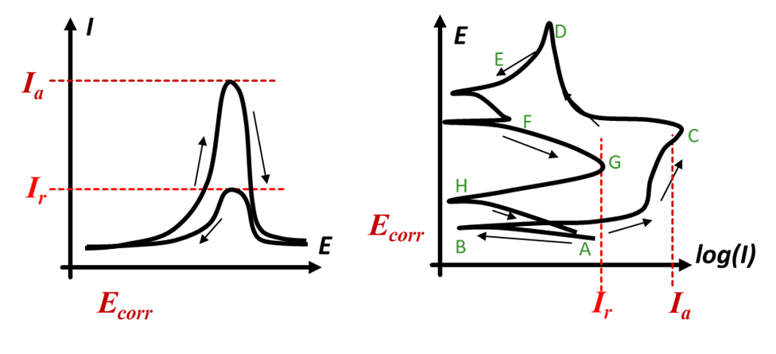

**电化学工作站：** 使用武汉科CorrTest电化学工作站CS310H及配套软件。

**电解溶液：** 电解溶液环境选择为0.5M H2SO4 + 0.01M KSCN，测试温度为室温。测试过程中为减少溶解氧干扰，使用氩气对容器进行持续除氧，使用磁力搅拌器保持溶液流动。

* H2SO4: $ 98 * 0.5 * 0.15  = 7.35g/200ml $
* KSCN: $ 97 * 0.01 * 0.15 =1.45g/150ml $

**工作电极：** 将样片用镍丝焊接，并使用环氧树脂包裹密封，仅露出样片的一面。使用碳化硅砂纸将电极表面打磨至2000#，并进行0.5um抛光。完成工作电极制备。

**对电极：** 将洁净光滑的Pt金属片焊接在Pt丝上，使用聚四氟乙烯热缩管进行导线密封。Pt金属片即为对电极。

**参比电极：** 参比电极选用商用饱和甘汞电极，

* 电极符号：**Pt | Hg(l) | Hg2Cl2(s) | KCl(饱和)**
* 电极反应：$ Hg_2Cl_2 + 2e^- = 2Hg + 2Cl^- $
* 电极电位：见下表
| **电极名称** | **KCl浓度mol/L**         | **电极电势 V**       |
| :- | :--------- | :------- |
| **饱和甘汞电极（SCE）** | 饱和溶液 | 0.2438 |
| **标准甘汞电极（NCE）** | 1.0      | 0.2828 |
| **0.1mol/L甘汞电极** | 0.10     | 0.3365 |

**扫描范围：** -100vsOCP -> 350C vs SCE

---

[1]: GB/T 29088-2012 金属和合金的腐蚀 双环电化学动电位再活化测量方法[S].

[2]: CHEN K, WANG J, DU D, et al. Stress Corrosion Crack Growth Behavior of Type 310S Stainless Steel in Supercritical Water[J]. CORROSION, 2018,74(7): 776-787.

[3]: PARDO A, MERINO M C, COY A E, et al. Influence of Ti, C and N concentration on the intergranular corrosion behaviour of AISI 316Ti and 321 stainless steels[J]. Acta Materialia, 2007,55(7): 2239-2251.