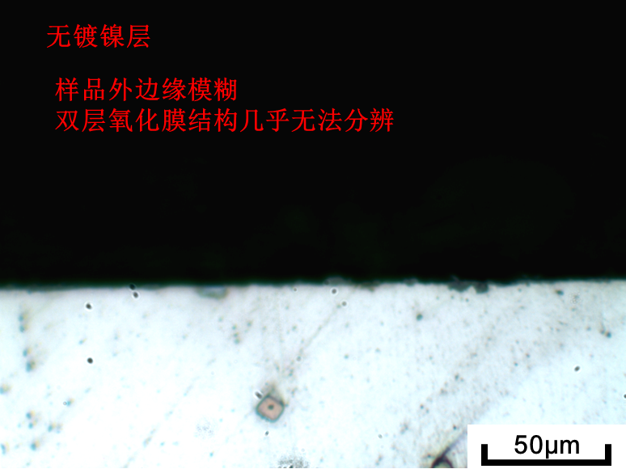
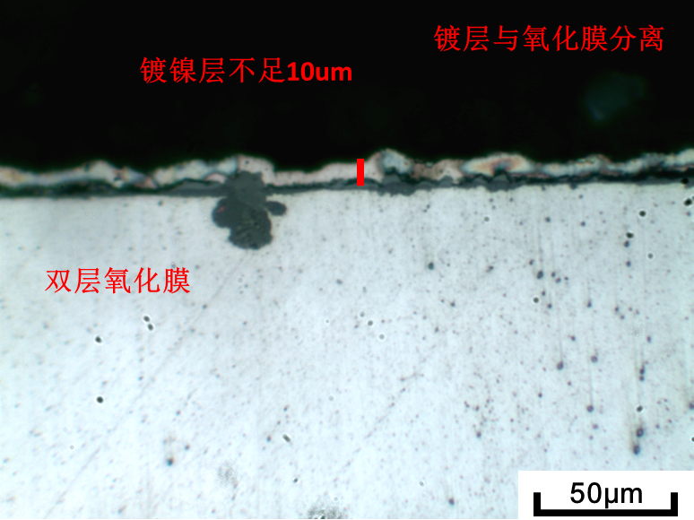
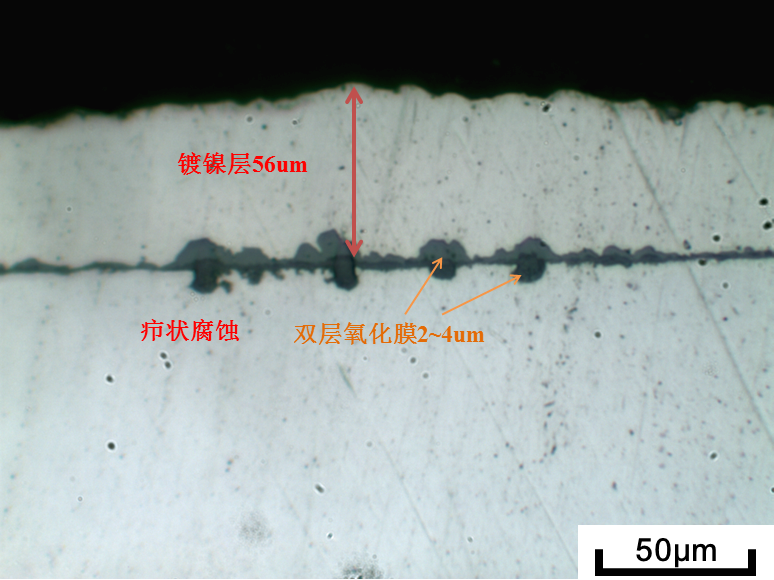
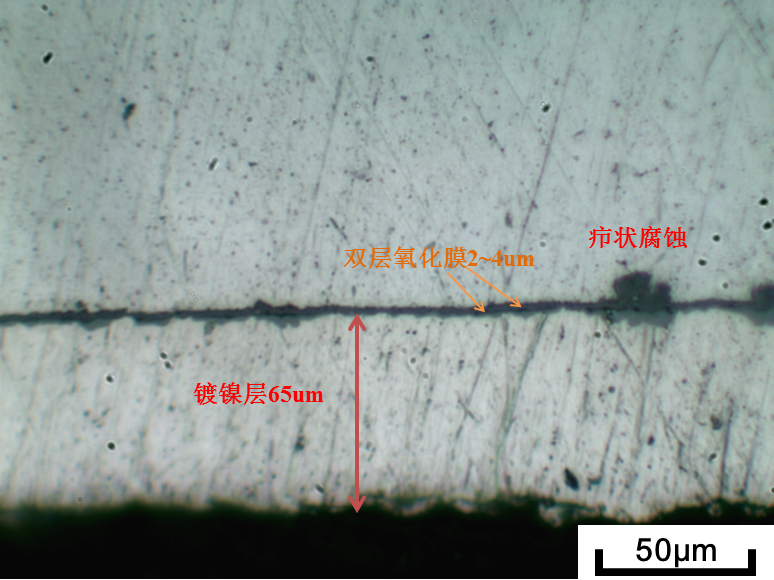
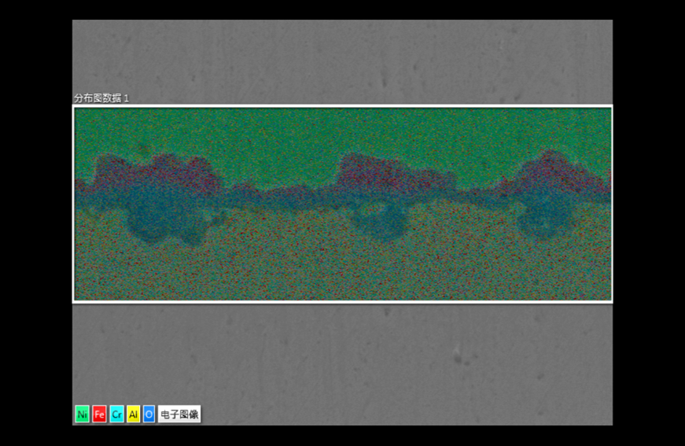
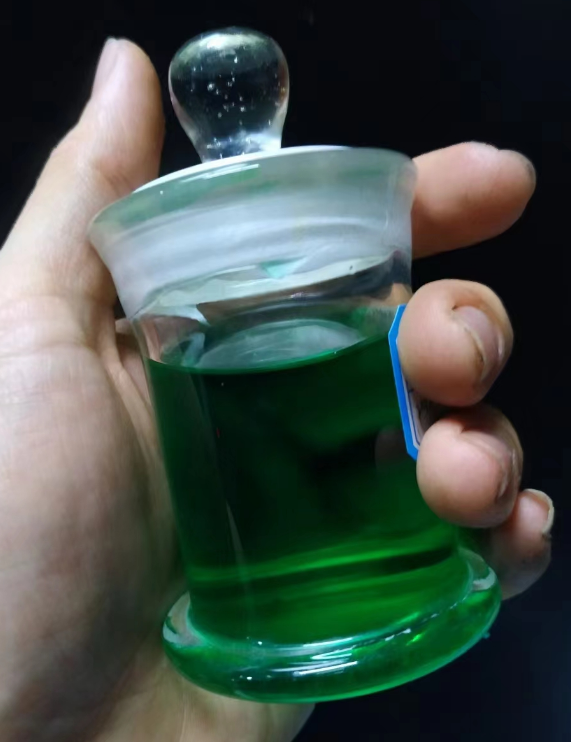

!> 氧化膜观察是材料均匀腐蚀分析过程中的重要一环，通常使用截面样品观察的方式进行氧化膜分析，这一过程需要首先使用线切割、慢速切割等方式切出截面，之后通过冷镶嵌或热镶嵌的方式将样品固定在镶料中，最后经过机械磨抛和振动抛光以获得无划痕的截面。然而在磨抛过程中，切削力将导致镶料与待观察样品分离出现缝隙，这一缝隙的存在会导致样品边缘过度磨削——即出现圆弧，最终导致较薄的氧化膜无法很好的被观察到。

?> 通过电镀方式将镀膜与待测表面紧密结合（原子级别），其结合力更强，磨削过程中不易发生分离，能够最大限度地保证较薄的氧化膜经过磨削后仍能保持同一平面，最终提升SEM的拍摄效果和能谱分析的精度。
## 任务目标：
* 在均匀腐蚀样品表面镀膜2层，第一层为碳覆膜，第二层为电镀镍膜。
*  镀膜后进行截面形貌观察，保证氧化膜完整性以及良好的观察效果。

## Step1：样品准备

使用慢速切割机切片，样品沿刀片径向，氧化物面垂直于走刀方向。

样品表面使用酒精超声清洗，去除表面污渍，并烘干，防止镀膜后膜破损。

## Step2：碳覆膜（导电良好的样品可跳过）

首先制备原始状态材料，测试覆膜的强度、镶嵌磨抛后的脱落情况等。在确认蒸碳工艺及电镀覆膜工艺无误后再进行下一步操作。

选用原始样品统一镀膜，蒸碳15s即可，$20 * 10 * 1$ 样品，预计一次4片。

## Step3：电镀膜

* **装置：** 使用100ml玻璃杯，溶液配制约100mL；
* **溶液：** 硫酸镍作主盐（250g/L，$ NiSO_4·6H_2O $）+氯化镍活化阳极（40g/L）+硼酸缓冲剂（20g/L，$NiCl_2·6H_2O）十二烷基硫酸钠润湿剂（0.1g/L）；
* **环境：** 温度50℃，pH≈4；
* **电源：** $1.4 V$，$1-4 A/dm^2$ ，即$0.01-0.04 mA/cm^2$；
* **电极：** 阳极为镍片，阴极为待镀样品；

镀镍厚度估算：$0.196 * I * t$，即$1 A$，10分钟约$1.96 um$。计划使用$15 min$即$(1+8)um$厚度镍层。

## **Step4：镶样**

切片后使用热镶，一组2~4片。

磨抛时镀膜面垂直磨抛方向，400#砂纸磨抛时间尽可能短，不得大于50s。800#及1200#砂纸长时间磨抛划痕，最终1um抛光。

## 效果展示：

|      |  |
| :---------------------------------------------: | ------------------------------------------------- |
|   |      |

## 后记（2023年12月）
在实际操作的过程中，发现了很多可能影响效果的问题，接下来列举如下：
* 本人使用的镍盐为颗粒状的水合晶体，配置后效果如下，从颜色上是较为深绿的，但溶液整体仍保持一定的透明度。

  

* 镀镍层分离问题：一般由于溶液温度偏低、电流过高导致镍膜的结合力下降，取出后容易脱落。在正式镀镍之前，请务必反复用备用样品进行测试，避免对珍贵样品的损伤。

## 题外话：
  * 氧化膜抗腐蚀性能与导电性能的关系，一般而言在水中腐蚀形成的氧化膜都与金属的电化学行为有着些许联系，其实可以推断，当氧化膜保护性较好的时候，也就意味着其对电化学行为的抑制作用较强，可以认为是导电性较差的。
  * 那么在镀镍的过程中，这种氧化膜的镀镍的难度也就更大，需要表面预先进行充分的喷金来实现导电性能的提升。
  * 当然镀镍前也不应该过度喷金，过长时间的喷金也可能导致氧化膜受损伤，一般15-30s即可。当然因设备和样品而异。