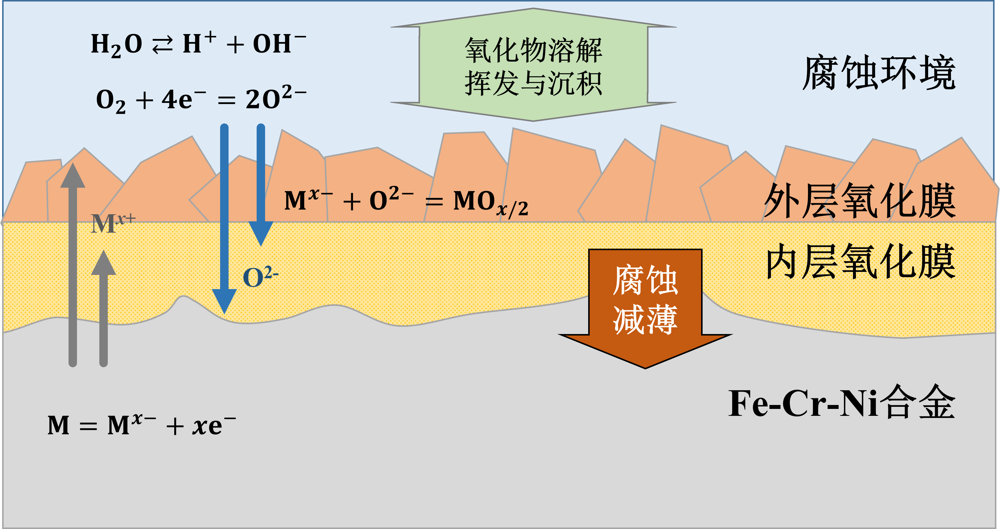

> 材料在服役环境中发生的均匀的氧化、腐蚀行为，无载荷或低载荷。是各类材料必然发生的行为（除非真空且不与其他物质接触）。具有一定腐蚀性的工质可以是高温空气、二氧化碳、水蒸气和水，也可以是含有氧或者氧化物的其他工质。

## 金属氧化原理

以最为常见的铁铬镍合金（Fe-Cr-Ni：如钢、镍基合金等）为例，其基本的氧化过程是相似的。根据**金属高温氧化原理**[^1] [^2] [^3]，在高温水环境中，合金材料表面主要存在**电化学氧化（EO）**和**化学氧化（CO）**两种过程。

合金表面的金属（M）与水分子、氧分子或水中的离子发生化学或电化学反应，形成相应的金属氧化物。一般内层氧化膜由固态生长过程形成，即氧离子向基体内扩散并与金属结合形成氧化物。




### 电化学氧化 EO
高温水环境下合金的 EO 过程的本质是金属在电解质环境中发生的原电池反
应[^4]。金属自身的氧化电位相比高温水环境的电位而言较低，在电化学电势的作用下，金属元素与水溶液中电离出的H+ 和OH– 离子发生氧化还原反应，从而形成金属阳离子或金属氧化物，并释放氢气或氧气。


### 化学氧化 CO

EO 过程中主要参与金属氧化反应的是水分子和水中溶解的氧分子，根据
Wagner 模型[^5] [^6]，金属/氧化物以及氧化物/环境相界面上发生的电子交换过程速率非常快，而金属阳离子和氧的阴离子在氧化膜中的扩散是主要的氧化增重（增厚）速率控制过程。其扩散的主要驱动力是氧化膜内外界面上的金属离子浓度和氧分压差。


### 均匀腐蚀的主要影响因素

- **温度**：一方面是在动力学上加速氧化反应、元素扩散的速率，提升材料的腐蚀速率。另一方面则是在热力学上影响不同腐蚀机制对腐蚀过程的贡献。
- **加工变形**：加工变形包含了冷加工过程产生的材料整体变形与表面加工过程产生的材料表层变形。变形导致微观结构发生变化，影响了材料表面的化学活性和基体中的元素扩散过程。
- **溶氧与pH**：即环境的水化学状态。根据材料高温氧化的机理可知，在金属氧化的EO过程中，溶氧和pH共同决定了腐蚀产物的种类，影响着表层氧化膜的溶解或沉积速率。
- **其他**：对于材料的均匀腐蚀而言，其他可能产生明显影响的因素还包括：合金中元素含量、工质压力、杂质离子等。

?> 著名阿伦尼乌斯公式——描述温度对化学反应的动力学作用
 $$
 k_c = k_{c0} \exp \frac{-Q}{RT}
 $$


## 腐蚀试验的基本方法

<center>

```markmap
### **均匀腐蚀**
#### **待测材料**
 - **锆合金**：包壳
 - **低碳钢**：容器、管道
 - **不锈钢**：容器、焊接、管道、紧固件、包壳
 - **镍基合金**：容器、焊接、管道、弹簧、紧固件
 - **铁马钢**：容器、管道、包壳
 - **高熵合金**：管道、紧固件
 - **非金属**：包壳、涂层
#### **测试环境**
 - **低中温**：加热海水、常温水等常压或低压工况
 - **一回路**：硼酸氢氧化锂水，含氢，可加锌
 - **二回路**：纯水、两相流、蒸汽，含氨、联胺等
 - **超临界水**：临界水以上纯水
 - **变工况**：水中可高浓碱、高浓氯、含氧
 - **二氧化碳**：超临界二氧化碳
 - **熔融物**：钠、钾、铅、铅铋等金属，钍基熔盐
#### **测试过程**
 - **离线式**：将样品定期从测试环境中取出，再进行分析表征
 - **在线式**：通过直接或间接手段，在线测量样品的物理参数变化
#### **评价方法**
 - **增重法**：测量样品腐蚀前后的重量变化，根据变化量计算腐蚀增重
 - **减重法**：测试后使用脱膜技术去除样品氧化膜，根据变化量计算腐蚀速率
 - **测厚法**：通过微观表征、超声测厚、电磁测厚等，计算氧化膜或基体厚度变化
 - **其他**：从机理角度，利用其他表征手段评价材料性能
#### **基本流程**
 - **原料处理**：如熔炼、锻造、热处理、变形加工、表面处理等
 - **样品加工**：从原料上切取一定形状的样品，并进行测试前的预处理
 - **腐蚀测试**：在稳定、可监测的测试环境中浸泡制定时长
 - **数据测量**：记录测试过程的环境参数、样品参数的变化
 - **微观表征**：对测试前后的样品进行微观表征，分析其微观结构变化
 - **机理分析**：出具测试报告，分析材料腐蚀失效规律和机理。
```

</center>

[^1]: STELLWAG B. The mechanism of oxide film formation on austenitic stainless steels in high temperature water[J]. Corrosion science, 1998, 40(2): 337-370. DOI: 10.1016/S0010-938X(97)00140-6

[^2]: BIRKS N, MEIER G H, PETTIT F S. 金属高温氧化导论. 第 2 版[M]. 北京: 高等教育出版社, 2010.

[^3]: 刘永辉, 张佩芬. 金属腐蚀学原理[M]. 北京: 航空工业出版社, 1993.

[^4]: 曹楚南. 腐蚀电化学原理 (第三版)[M]. 北京: 化学工业出版社, 2008.

[^5]: WAGNER C. Elementarvorgänge bei der Bildung von Metalloxyd aus Metallund Sauerstoff sowie bei verwandten Reaktionen[J]. Angewandte Chemie, 1936, 49(41): 735-740. DOI: 10.1002/ange.19360494102.

[^6]: WAGNER C. Elektrolytische Wanderung in flüssigen und festen Metallen. Von K. E. Schwarz. 95s., 52 Abb. Verl. J. A. Barth, Leipzig 1940. Pr. kart. RM. 9,60 [J]. Angewandte Chemie, 1940, 53(19-20): 217-217. DOI: 10.1002/ange.19400531915.
