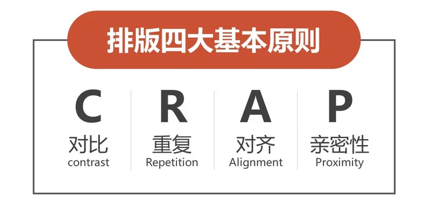
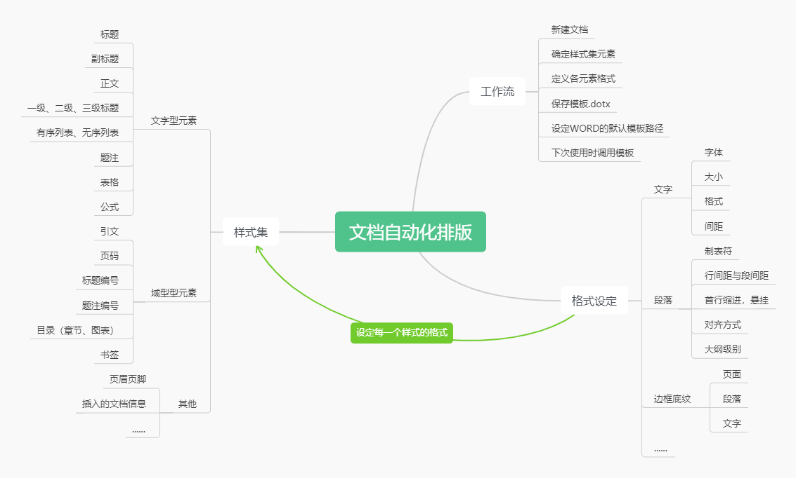
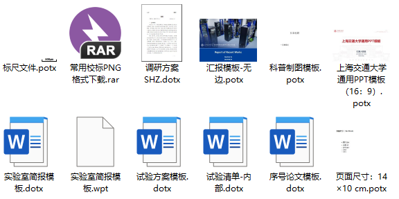
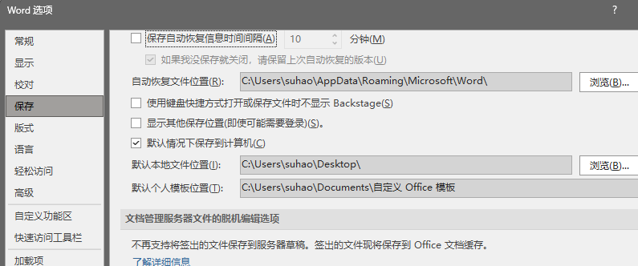
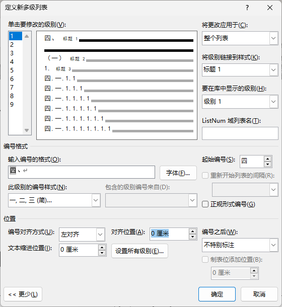

?> 文字报告和演示的排版技巧，见字如面。虽然酥师傅长得不咋地，但对自己的排版技术还是有一定的自信的。

## 排版基础

> ### 对比
> 要素之间存在差异，通过字体、字号、颜色等，明确区分两种或多种元素。突出重点，能够使人分清主次，例如标题使用不同颜色、黑体、加粗。

> ### 重复
> 保持页面的一致性，在文字为主的报告中体现在同一种元素使用相同格式，保持一定的规律。例如使用列表，使用统一的图、表格式。在制作PPT中使用相同的页面模板等。通过规律性的、重复性的内容来便于读者阅读

> ### 对齐
> 文字、页面、图片、表格的边缘能够对齐，展现出一定的形状。多段文字的双端对齐、图片的居中，表格中数字的小数点对齐等。也是为了方便阅读，美化观感。

> ### 亲密性
> 相关联的元素更加紧密，给读者直观的提示，快速掌握页面主旨内容。例如调整标题行间距使之与后续段落更加紧密。

## 模板设计

### 正确区分模板文件
Word、Excel和PowerPoint的模板文件分别为`.dotx, .dot`, `.xltx, .xlt`, `.potx, .pot`。其余格式的所谓“模板”并不能直接复用进行文档新建，只能通过复制文档或另存为的方式制作新文档。

另外需要注意在Office软件里面设置模板默认的保存路径，这样每次新建文档的时候就可以在初始界面上看到“个人模板”，并选择你已经保存好的模板文档。

### 格式、样式到模板
- Word中可以通过设计复用模板的样式、配色、字体等。
  - 首先设定正文、各级标题、题注等重要样式。
  - 其次右击样式进行字体、段落、编号、边框、底纹等样式的设计。
  - 最后根据需要进行一些微调，保存为**模板文件**。
- Excel中可以将常用的图表样式保存为用户模板。
  - 主要是制作一些表格样式，包括图表样式，便于下次使用。
- PowerPoint中可以设置模板样式、图形默认格式等。
  - 进入母版视图。
  - 设计背景、标题、章节标题、正文的格式。
  - 制作几张示例页面（当然也可以不用）。
  - 保存模板文件。

## 操作技巧

### 大纲级别与编号问题
在“多级列表-定义新的多级列表”中进行设置，记得几个关键要点：
- 将级别连接到样式：对应标题1、标题2、标题3...
- 对齐方式和缩进：设计相应的对齐方式
- 编号样式：一、（一）、1、等
- 编号之后：后面是空格、制表位还是什么都没有

设置好以后就可以标题的自动编号了。

### 善用自动修正功能
日常在输入pH、℃、μm的时候经常需要切换大小写、输入法、甚至要手动插入符号。
但使用自动修正可以快速插入一些符号、特定名词。

?> 其他还有很多操作小技巧，MS Office三件套的功能很全面，大家可以在日常中多百度、多搜索、多学习、多实践。