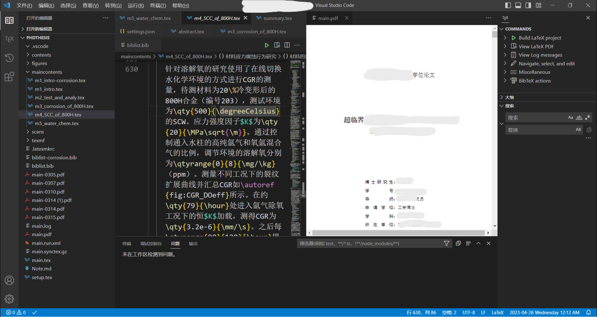
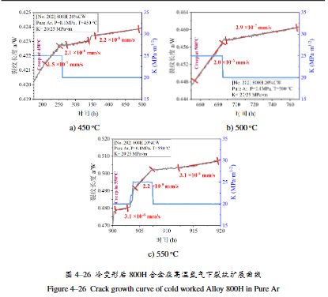
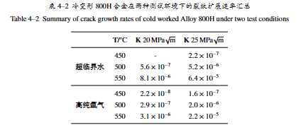

> 由于强迫症引发的使用LaTeX的冲动，当然也包括学习使用新鲜工具的那种激情在里面，最终促使我使用LaTeX编写了整个毕业论文。总体感受下来有几个关键的优势和问题：
>
> 1. 纯粹的打字，很多格式排版问题都可以使用相同的代码片段实现，整体上不需要担心各种编号、公式、图片的效果，最大限度地沉浸于打字创作中。
> 2. 清晰的排版效果，确实比Word要好很多，特别是公式及其编号，多栏图片的排版。
> 3. 配合Markdown十分舒适，很多公式可以直接复制。
> 4. 学习成本问题：确实刚刚上手有些困难，环境配置和很多新的命令会让人头大，而且，Word用的好的话，其实也可以实现各类效果，也蛮好用的。
> 5. 协同办公问题：很难像Word WPS这样协同办公，其他人的学习成本也会比较高。

## **配置效果：**

其实在这样的环境下写论文，搞创作还是很有感觉的，自己还安装了很多VS Code插件（但多数是美化），整理了一个算是舒适的工作环境。



## 安装过程

### **MikTeX安装与配置**

* 官网下载：[官网连接](https://miktex.org/download)
* 并在系统环境变量中的Path中添加MikTeX的路径。

### VS Code安装
* 跳过

### 安装perl

* 脚本解释器，勾选`添加到path`

---

## 基本语法

* 源文档`.tex`
* 引用文献`.bib`
* 文献引用`\cite{<ref>}`
* 在相应位置插入参考文献`\bibliography{<ref.bib>}`
* 注释`%`

### 单位（自动实现单位之间空格）

```LaTeX
% setup.tex文档中修改，引用siunitx宏包，去掉v2表示使用最新版的宏包，可使用\qty命令。
\usepackage{siunitx}%[=v2]
\DeclareSIUnit\angstrom{Å}
\sisetup{compound-exponents =  combine-bracket ,
    product-exponents =  combine-bracket ,
    range-exponents =  combine-bracket,
    range-units = single
  }
```

使用`\qty{}{}`表示带单位的数据

```LaTeX
\qtyrange{1}{2}{\um} 表示 1~2 μm 范围
\qtylist{1;2;3;4}{\um} 表示 1、2、3和4 μm 列表
\unit{} 表示只有单位没有数字
\num{1e-10} \numlist{1;2;3;4} \numrange{1}{2} 表示仅有数字没有单位
```

?> 注意：列表和范围的表示方法可变，包括替换连字符、是否每个列表数据都带单位、科学计数法的表示等。详细可见[siunitx](https://ctan.org/pkg/siunitx)

### **章节与分段**

```LaTeX
\chapter{}
    \section{}
        \subsection{}
        \subsubsection{}
```

### **数字与公式**

### **图片插入**

```LaTeX
%双图
\begin{figure}[!htbp] %here:在此处插入图片，top：在页面顶端，bottom：页面低端，p：浮动——即单图或多图连续占据整张页面。
  \centering # 整体均居中显示
  \begin{subfigure}{0.3\textwidth} %所占宽度（0.3倍文字宽度）
    \centering #subfigure区域内居中
    \includegraphics[height=2cm]{sjtu-vi-badge-blue.pdf} %限定宽度使用 width
    \caption{校徽}
    \label{fig:xxxxx} % 在子图中使用label同样可以标记位置，正文中引用该label时显示 “图 x - x a” 字样。
  \end{subfigure}
  \begin{subfigure}{0.4\textwidth}
    \centering
    \includegraphics[height=1.5cm]{sjtu-vi-name-blue.pdf}
    \caption{校名。注意这个图略矮些，subfigure 中同一行的子图在顶端对齐。}
  \end{subfigure}
  \bicaption{包含子图题的范例（使用 subfigure）}{} %bicaption表示中英文双题注
  \label{fig:subfigure}

  \begin{subfigure}{0.4\textwidth} % 若子图分为两行，则在换行处增加一空行，则编译后自动换行
    \centering
    \includegraphics[height=1.5cm]{sjtu-vi-name-blue.pdf}
    \caption{校名。注意这个图略矮些，subfigure 中同一行的子图在顶端对齐。}
  \end{subfigure}
  \bicaption{包含子图题的范例（使用 subfigure）}{} % bicaption表示中英文双题注
  \label{fig:subfigure}
\end{figure}
```


### **表格**

```LaTeX
\begin{table}[!htbp]
     \centering
     \bicaption{冷变形800H合金在两种测试环境下的裂纹扩展速率汇总}{Summary of crack growth rates of cold worked Alloy 800H under two test conditions}
     \label{tab:CGR_All}
     \begin{tabular}{c ccc} %居中
       \toprule %三线表的上线
         & \textbf{T/\unit{\degreeCelsius}} & \textbf{K \qty{20}{\MPa\sqrt{m}}} & \textbf{K \qty{25}{\MPa\sqrt{m}}}  \\
        \midrule %三线表的中线
        \multirow{3}{*}{\textbf{超临界水}}
         & 450 & -            & \num{2.2e-7} \\
         & 500 & \num{5.6e-7} & \num{5.2e-6} \\
         & 550 & \num{8.1e-6} & \num{6.4e-5} \\
        \midrule %三线表的第二根中线
        \multirow{3}{*}{\textbf{高纯氩气}}
         & 450 & \num{2.2e-8} & \num{1.6e-7} \\
         & 500 & \num{2.9e-7} & \num{2.0e-6} \\
         & 550 & \num{3.1e-6} & \num{2.2e-5} \\
        \bottomrule%三线表的底线
     \end{tabular}
    \end{table}
```


### **引用**

建议使用`autoref{xxx:yyy}`格式，将自动携带前缀的 “图；表；式；章”等信息。

其`label`中分别使用“`fig`” “`tab`” “`con`”作为区分标记

```LaTeX
% 自动引用题注更正为中文
% setup.tex文档中插入以下内容实现autoref
\def\equationautorefname{式}
\def\footnoteautorefname{脚注}
\def\itemautorefname{项}
\def\figureautorefname{图}
\def\tableautorefname{表}
\def\partautorefname{篇}
\def\appendixautorefname{附录}
\def\chapterautorefname{章}
\def\sectionautorefname{节}
\def\subsectionautorefname{小节}
\def\subsubsectionautorefname{小节}
\def\paragraphautorefname{段落}
\def\subparagraphautorefname{子段落}
\def\FancyVerbLineautorefname{行}
\def\theoremautorefname{定理}
\renewcommand{\eqref}[1]{式 (\ref{#1})} % 定义公式引用时将编号置于“（）”内
```

### **文献引用**

引文信息插入bib.tex文档中，请将引文信息中的“%”删除，以免出现错误编译；

正文插入引文格式则为` \cite{xxxx}` “`xxxx`”为`bib.tex`的引文信息中的第一行信息。

**快捷键：**

* ***noteexpress***中，正文插入引文，可以连续选中多个需要引用的文档，按下“`Ctrl+Shift+B`”，到LateX文档中粘贴“`\cite{xxx1,xxx2,xxx3,...}`”
* ***noteexpress***中，设定预览格式为`bibtex`，则按下“`Ctrl+Shift+V`”格式化复制时，直接复制走相应的bibtex格式信息。

——引文及信息对应的编号（一般为“作者-编号”格式）在引文复制或Bibtex格式化复制的过程中自动生成，且同一数据库内的文档不会出现重复编号。

### **列表**

```LaTeX
% “1）”编号列表
    \begin{enumerate}[label = \arabic*)]
     \item 将测试流程标准化，规范要求样品加工、表面处理、设备状态控制和数据处理的各个流程，将实验过程中存在显著影响但常被忽略的因素进行量化和记录；
     \item 对已有数据进行大数据统计和筛选，从操作规范的角度，考察文献、报告中的已有数据，根据操作与数据记录、增重/失重结果和微观组织表征三个方面的契合程度，划分已有数据的质量和可靠性的高低；
     \item 完善物理-经验模型，将参数化程度高、数据精度高的实验结果用于经验模型的建立，和物理参数的推导，并借助物理模型对已有的数据进行筛选。最终构建半物理半经验模型和可靠的实验数据集，从而实现对腐蚀行为的高精度预测。
  \end{enumerate}
```

## **VS code配置**

安装LaTeX-workshop插件，在`setting.json`中配置以下内容：
<details>
<summary>详细设定，内容过长（点击展开）</summary>

```json
{
	"editor.fontSize": 20,
	"latex-workshop.latex.clean.fileTypes": [
		"*.aux",
        "*.bbl",
        "*.blg",
        "*.idx",
        "*.ind",
        "*.lof",
        "*.lot",
        "*.out",
        "*.toc",
        "*.acn",
        "*.acr",
        "*.alg",
        "*.glg",
        "*.glo",
        "*.gls",
        "*.ist",
        "*.fls",
        "*.log",
        "*.fdb_latexmk",
		"*.snm",
		"*.synctex(busy)",
		"*.synctex.gz(busy)",
		"*.nav",
		"*.vrb",
		"*.bcf",
		"*.xdv"
	],
	"latex-workshop.view.pdf.internal.synctex.keybinding": "double-click",
	"latex-workshop.showContextMenu": true,

	"editor.unicodeHighlight.allowedLocales": {
		"zh-hans": true,
		"zh-hant": true
	},
	"latex-workshop.latex.recipes": [
		{
			"name": "latexmk (xelatex)",
			"tools": [
				"xelatexmk"
			]
		}
	],
	"latex-workshop.latex.recipe.default": "lastUsed",
	"latex-workshop.latex.tools": [
		{
			"name": "xelatexmk",
			"command": "latexmk",
			"args": [
				"-synctex=1",
				"-interaction=nonstopmode",
				"-file-line-error",
				"-xelatex",
				"-outdir=%OUTDIR%",
				"%DOC%"
			],
			"env": {}
		},
		{
			"name": "latexmk",
			"command": "latexmk",
			"args": [
				"-synctex=1",
				"-interaction=nonstopmode",
				"-file-line-error",
				"-pdf",
				"-outdir=%OUTDIR%",
				"%DOC%"
			],
			"env": {}
		},
		{
			"name": "lualatexmk",
			"command": "latexmk",
			"args": [
				"-synctex=1",
				"-interaction=nonstopmode",
				"-file-line-error",
				"-lualatex",
				"-outdir=%OUTDIR%",
				"%DOC%"
			],
			"env": {}
		},
		{
			"name": "latexmk_rconly",
			"command": "latexmk",
			"args": [
				"%DOC%"
			],
			"env": {}
		},
		{
			"name": "pdflatex",
			"command": "pdflatex",
			"args": [
				"-synctex=1",
				"-interaction=nonstopmode",
				"-file-line-error",
				"%DOC%"
			],
			"env": {}
		},
		{
			"name": "bibtex",
			"command": "bibtex",
			"args": [
				"%DOCFILE%"
			],
			"env": {}
		},
		{
			"name": "rnw2tex",
			"command": "Rscript",
			"args": [
				"-e",
				"knitr::opts_knit$set(concordance = TRUE); knitr::knit('%DOCFILE_EXT%')"
			],
			"env": {}
		},
		{
			"name": "jnw2tex",
			"command": "julia",
			"args": [
				"-e",
				"using Weave; weave(\"%DOC_EXT%\", doctype=\"tex\")"
			],
			"env": {}
		},
		{
			"name": "jnw2texminted",
			"command": "julia",
			"args": [
				"-e",
				"using Weave; weave(\"%DOC_EXT%\", doctype=\"texminted\")"
			],
			"env": {}
		},
		{
			"name": "pnw2tex",
			"command": "pweave",
			"args": [
				"-f",
				"tex",
				"%DOC_EXT%"
			],
			"env": {}
		},
		{
			"name": "pnw2texminted",
			"command": "pweave",
			"args": [
				"-f",
				"texminted",
				"%DOC_EXT%"
			],
			"env": {}
		},
		{
			"name": "tectonic",
			"command": "tectonic",
			"args": [
				"--synctex",
				"--keep-logs",
				"%DOC%.tex"
			],
			"env": {}
		}
	],
	"latex-workshop.latex.autoClean.run": "onBuilt",
	"editor.suggest.showColors": false,
	"editor.suggest.showCustomcolors": false,
	"editor.wordWrap": "bounded",
	"workbench.editor.wrapTabs": true,
	"latex-utilities.countWord.docker.enabled": true,
	"latex-utilities.countWord.format": "${words} Words",
	"latex-utilities.formattedPaste.customTableDelimiter": "  ",
	"workbench.preferredHighContrastLightColorTheme": "Default Light+ Experimental",
	"workbench.editor.highlightModifiedTabs": true,
	"latex-wordcount.selectTimeOut": 2000,
	"latex-workshop.texcount.interval": 2000,
	"workbench.editor.decorations.colors": false,
	"workbench.localHistory.maxFileEntries": 20,
	"window.confirmBeforeClose": "keyboardOnly",
	"latex-workshop.latex.autoBuild.run": "never",
	"latex-workshop.view.outline.floats.enabled": false,
}
```
</details>

## 特别鸣谢：SJTU Thesis模板

?> [**SJTU Thesis模板**](https://github.com/sjtug/SJTUThesis)

PS: 在使用交大论文模板之前请务必仔细阅读其说明。

### 图片制作：
我是在项目路径下按章节准备了素材库，图片素材的生成都遵循一定的存储和命名规范，保证在编译引用的时候不会出错。

?> 图表制作和美化计可以参照 ：
<a href ="屁屁踢制图模板.potx" target="_blank">**屁屁踢制图模板**</a>